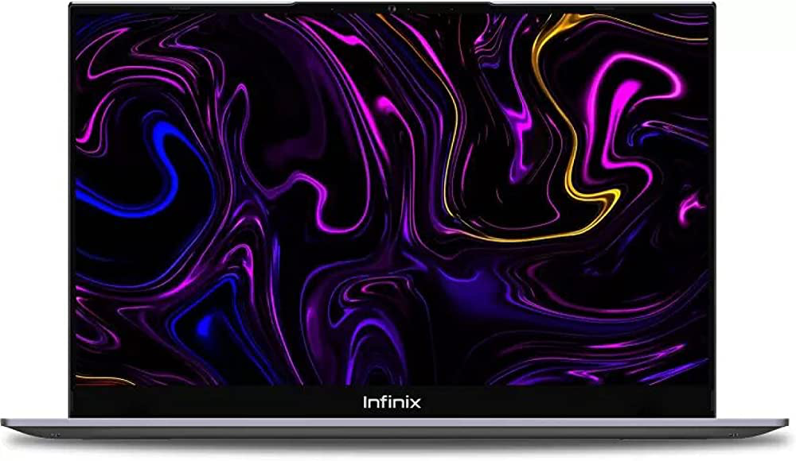
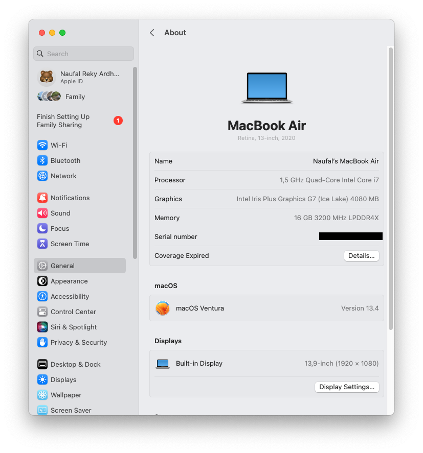
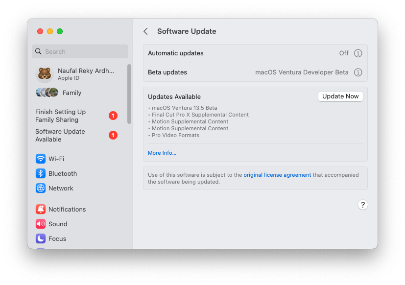
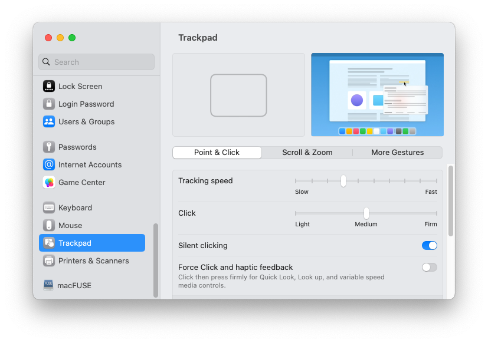
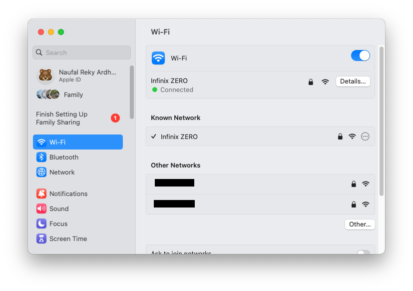
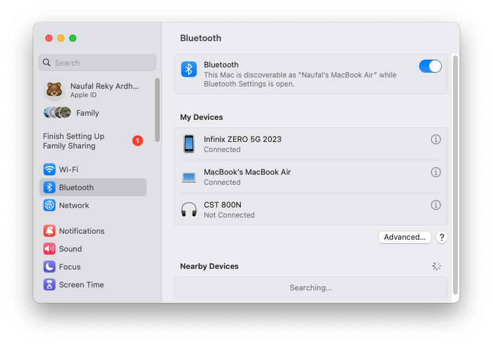

<h1 align="center"> Infinix X1 Pro Hackintosh</h1>

 

  

A Hackintosh project for the Infinix X1 PRO 14" built on top of the [OpenCore](https://github.com/acidanthera/OpenCorePkg) bootloader

<h3>macOS Version Supported:</h3>

Ventura latest version (I only tested for ventura, but it should work for other versions too. Just change the `.kext` files according to your version)

Eligible for beta tester (Which means you can do OTA update)

<h3>Hardware Information</h3>

| Component | Model                                     |
|-----------|-------------------------------------------|
| Processor | Intel(R) Core(TM) i7-1065G7 CPU @ 1.30GHz |
| Memory    | 16GB LPDDR4X 3200MHz                      |
| Storage   | TEAM TM8FP6 512GB NVMe SSD                |
| Graphics  | Intel Iris Plus Graphics G7               |
| Audio     | Realtek ALC269 (alcid = 18)               |
| Wifi      | Intel AX201                               |
| Bluetooth | Intel AX201                               |

<h3>What's working</h3>
<table>
  <thead>
    <tr>
      <th>Component</th>
      <th>Device</th>
      <th colspan=2>Status</th>
    </tr>
  </thead>
  <tbody>
  <!-- Processor -->
    <tr>
      <td>CPU</td>
      <td>Intel(R) Core(TM) i7-1065G7 CPU @ 1.30GHz 
      <td style="text-align: center;">✅</td>
      <td>Natively supported (since macOS Catalina).</td>
    </tr>
  <!-- Graphics -->
    <tr>
      <td rowspan=2>Graphics</td>
      <td>Intel Iris Plus Graphics G7 (Ice Lake)</td>
      <td style="text-align: center;">✅</td>
      <td>Full acceleration (QE/CI)</td>
    </tr>
    <tr>
    </tr>
  <!-- Displays -->
    <tr>
      <td rowspan=2>Displays</td>
      <td>13,9-inch (1920 × 1080) (IPS 60 Hz)</td>
      <td style="text-align: center;">✅</td>
      <td>Fully supported (with backlight control).</td>
    </tr>
    <tr>
    </tr>
  <!-- Interfaces -->
    <tr>
      <td rowspan=6>Interfaces</td>
      <td>Built-in Keyboard</td>
      <td style="text-align: center;">✅</td>
      <td>Fully supported (with media keys and backlight control).</td>
    </tr>
    <tr>
      <td>Built-in Trackpad</td>
      <td style="text-align: center;">✅</td>
      <td>Fully supported (GPIO pinned with multi-touch gestures)

</td>
    </tr>
    <tr>
    </tr>
    <tr>
    </tr>
    <tr>
<tr>
</tr>
    </tr>
  <!-- Audio -->
    <tr>
      <td rowspan=2>Audio (Realtek ALC269)</td>
      <td>Built-in speakers</td>
      <td style="text-align: center;">✅</td>
      <td>Fully supported (with volume control).</td>
    </tr>
    <tr>
      <td>Built-in microphone</td>
      <td style="text-align: center;">❌</td>
      <td>Not supported (probably wrong alcid)</td>
    </tr>
  <!-- Camera -->
    <tr>
      <td>Camera</td>
      <td>MTD Camera</td>
      <td style="text-align: center;">✅</td>
      <td>Fully supported</td>
    </tr>
  <!-- Wi-Fi + Bluetooth -->
    <tr>
      <td>Wi-Fi</td>
      <td rowspan=2>Intel AX201 (Wi-Fi 6 + Bluetooth 5.0)</td>
      <td rowspan=2 style="text-align: center;">✅</td>
      <td rowspan=2>Fully supported (with limited Continuity support).

</td>
    </tr>
    <tr>
      <td>Bluetooth</td>
    </tr>
  <!-- Storage -->
    <tr>
      <td>Storage</td>
      <td>TEAM TM8FP6 512GB NVMe SSD</td>
      <td style="text-align: center;">✅</td>
      <td>Fully supported (with power management) and fiixed random kernel panic by adding (forceRenderStandby=0) in boot-args</td>
    </tr>
  <!-- Ports -->
    <tr>
      <td>Ports</td>
      <td>(Left)
• 1x USB 3.0 Gen 2 Type-A 
• 1x USB 3.0 Gen 2 Type-C 
• 1x USB 2.0 Gen 2 Type-C 
(Right) • 1x USB 3.0 Gen 1 Type-A 
• 1x 3.5 mm Audio combo jack 
• 1x USB 3.0 Gen 2 Type-A 
• 1x USB 2.0 Gen 2 Type-A 
      <td style="text-align: center;">✅</td>
      <td>Fully supported.</td>
    </tr>
  <!-- Battery and Power -->
    <tr>
      <td rowspan=2>Battery</td>
      <td>Built-in Battery</td>
      <td style="text-align: center;">✅</td>
      <td>Fully supported (with power reading).</td>
    </tr>
    <tr>
      <td>AC Power Adapter</td>
      <td style="text-align: center;">✅</td>
      <td>Fully supported (with hotplug and charge limit feature).</td>
    </tr>
  </tbody>
</table>

### Software Features:
<table>
  <thead>
    <tr>
      <th>Type</th>
      <th>Feature</th>
      <th colspan=2>Status</th>
    </tr>
  </thead>
  <tbody>
  <!-- iServices -->
    <tr>
      <td colspan=2>iServices (iCloud)</td>
      <td style="text-align: center;">✅</td>
      <td>Fully supported.</td>
    </tr>
  <!-- Continuity -->
    <tr>
      <td rowspan=6>Continuity</td>
      <td>Airplay to Mac</td>
      <td style="text-align: center;">❌</td>
      <td>Untested.</td>
    <tr>
      <td>Sidecar</td>
      <td style="text-align: center;">❌</td>
      <td>Untested.</td>
    <tr>
      <td>Handoff</td>
      <td style="text-align: center;">❌</td>
      <td>Untested.</td>
    </tr>
    <tr>
      <td>Continuity Camera</td>
      <td style="text-align: center;">✅</td>
      <td>Supported.</td>
    </tr>
    <tr>
      <td>Universal Clipboard</td>
      <td style="text-align: center;">❌</td>
      <td>Untested.</td>
    </tr>
    <tr>
      <td>Universal Control</td>
      <td style="text-align: center;">❌</td>
      <td>Untested.</td>
    </tr>
  <!-- Sleep + Wake -->
    <tr>
      <td rowspan=2>Sleep / Wake</td>
      <td>Sleep</td>
      <td style="text-align: center;">✅</td>
      <td>Supported.</td>
    </tr>
    <tr>
      <td>Hibernation</td>
      <td style="text-align: center;">✅</td>
      <td>Supported.</td>
    </tr>
  <!-- Battery meter -->
    <tr>
      <td colspan=2>Battery Indication</td>
      <td style="text-align: center;">✅</td>
      <td>Fully supported.</td>
    </tr>
</table>